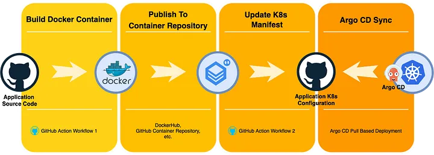
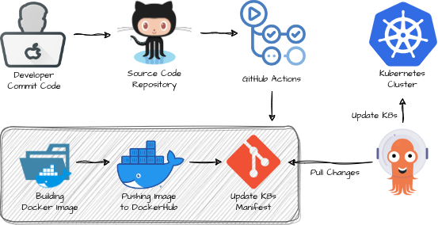
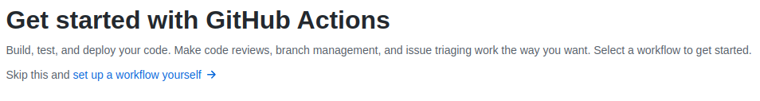
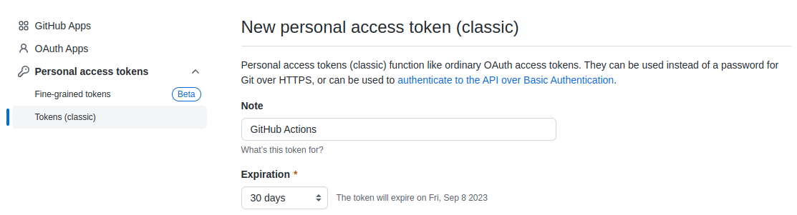
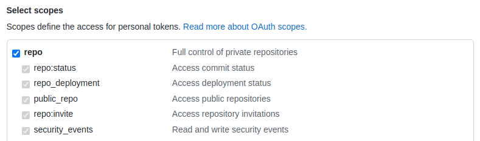
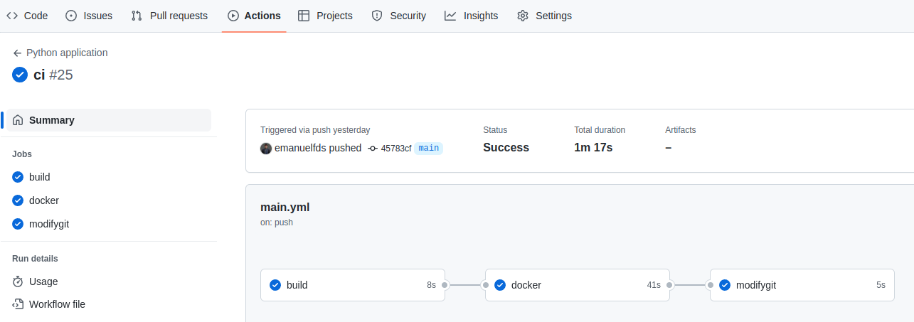

<div align="center">

 </center>

</div>

[](https://github.com/emanuelfds)
[](https://www.linkedin.com/in/emanuelfds/)


# CI/CD com GitHub, GitHub Actions, Argo CD e Cluster Kubernetes

## Breve Introdução

No cenário de rápida evolução do desenvolvimento e implantação de software, as organizações estão constantemente buscando maneiras mais eficientes de gerenciar o ciclo de vida de seus aplicativos. Os métodos tradicionais de implantações manuais e pipelines de integração contínua e entrega contínua (CI/CD) provaram ser demorados e propensos a erros. Entre no GitOps, uma abordagem moderna para entrega de software que aproveita o poder dos sistemas de controle de versão e automação para simplificar o processo de implantação.

O GitOps muda o paradigma usando o **`Git`** como a única fonte de verdade para o código do aplicativo e a configuração da infraestrutura. Ao adotar os princípios do GitOps, as organizações podem obter maior visibilidade, rastreabilidade e escalabilidade em suas implantações. Neste artigo, exploraremos a integração do GitOps com pipelines CI/CD, focando especificamente na combinação do **`GitHub Actions`** e **`ArgoCD`**.

Ao combinar os pontos fortes do GitHub Actions e do Argo CD, as organizações podem obter um poderoso pipeline de CI/CD de ponta a ponta que adota a filosofia GitOps. Os desenvolvedores podem fazer alterações em sua base de código, confirmá-los na ramificação principal e acionar uma série de ações automatizadas que criam, testam e implantam o aplicativo no ambiente desejado.

## Começando

Segue uma visão geral de como será realizada a configuração:

1. **Repositório Git:** será criado um repositório Git para armazenar o código de seu aplicativo.

2. **GitHub Actions:** vamos configurar o GitHub Actions criando um arquivo de workflow no diretório **`.github/workflows/`** do repositório. Usaremos o workflow do GitHub para acionar uma ação para criar a imagem, enviar para o DockerHub e modificar o arquivo de manifesto do Kubernetes conforme necessário para a implantação.

3. **Crie um cluster Kubernetes:** iremos configurar um cluster Kubernetes. Para a orquestração do Kubernetes, será usado o [K0S](https://docs.k0sproject.io/v1.27.4+k0s.0/). 

4. **Instalar o Kubectl:** 

5. **Instalar o ArgoCD:** instalar o ArgoCD no cluster K8s e configurar para se conectar ao seu repositório Git que contém arquivos de manifesto.

6. **Defina o aplicativo ArgoCD:** será definido um aplicativo ArgoCD para gerenciar a implementação de seus recursos do Kubernetes. Ativaremos a sincronização automática para que o ArgoCD possa detectar alterações no repositório Git e acionar implantações de acordo.

6. **Implante aplicativos com o ArgoCD:** o ArgoCD detectará automaticamente as alterações no repositório Git e implantará o aplicativo atualizado no cluster Kubernetes.

## Instalação dos Pré-requisitos

Para que possamos continuar daqui para frente, precisamos ter o seguinte instalado:

- Um cluster Kubernetes
- kubectl instalado

Para a orquestração do Kubernetes, será usado o [K0S](https://docs.k0sproject.io/v1.27.4+k0s.0/).

### Instalando o K0s

```bash
curl -sSLf https://get.k0s.sh | sudo sh
sudo k0s install controller --single
sudo systemctl start k0scontroller
sudo systemctl enable k0scontroller
```

### Instalando o kubectl

>**Nota**
>Você deve usar uma versão do kubectl que esteja próxima da versão do seu cluster. Por exemplo, um cliente v1.26 pode se comunicar com as versões v1.25, v1.26 e v1.27 da camada de gerenciamento. Usar a versão compatível mais recente do kubectl ajuda a evitar problemas inesperados.


#### Instale o binário kubectl no Linux usando o curl

```bash
curl -LO "https://dl.k8s.io/release/$(curl -L -s https://dl.k8s.io/release/stable.txt)/bin/linux/amd64/kubectl"
```
#### Instale o kubectl

```bash
chmod +x ./kubectl
sudo mv ./kubectl /usr/local/bin/kubectl
sudo cat /var/lib/k0s/pki/admin.conf > $HOME/admin.conf
mkdir -p $HOME/.kube
cat $HOME/admin.conf >> ~/.kube/config
```

Após finalizar a instalação do K0S e do Kubectl, valide a versão:

```bash
sudo systemctl status k0scontroller
kubectl version --client
```

## O Fluxo

<div align="center">

 </center>

</div>

Na imagem acima, você pode observar a integração perfeita. Você pode ver que estou usando **`GitHub Actions`** para criar uma imagem **`Docker`** e, em seguida, enviar a imagem para um repositório do **`DockerHub`**. Em seguida, será atualizada a versão da nova imagem no repositório Manifest Git. Estaremos configurando dois repositórios, um para o código do aplicativo e outro para os manifestos do Kubernetes.

Toda vez que seu código for alterado no [Repositório do Aplicativo](https://github.com/emanuelfds/App), uma nova imagem de contêiner do Docker será criada, enviada para o DockerHub e atualizará a tag de imagem no [Repositório do Manifesto do Kubernetes](https://github.com/emanuelfds/App-Manifest).

Assim que uma alteração é detectada no repositório Manifesto do Kubernetes, o ArgoCD entra em ação e começa a distribuir e implantar o novo aplicativo no cluster Kubernetes. Ele garante que a nova versão do nosso aplicativo seja implantada sem problemas, eliminando qualquer intervenção manual ou possíveis erros humanos.

## Implementação

Primeiro temos que criar um repositório GitHub e colocar o código do aplicativo nele.

Para o [Repositório do Aplicativo](https://github.com/emanuelfds/App), usaremos um aplicativo Flask simples que exibe uma página com o nome do pod que será empacotado em uma imagem do docker e publicado no DockerHub.

```yaml
from flask import Flask, render_template
from kubernetes import client, config
import os

app = Flask(__name__)
config.load_incluster_config()
v1 = client.CoreV1Api()

@app.route('/')
def index():
    pod_name = get_pod_name()
    pod_ip = get_pod_ip()
    return render_template('index.html', pod_name=pod_name, pod_ip=pod_ip)

def get_pod_name():
    pod_name = os.environ['HOSTNAME']
    namespace = open('/var/run/secrets/kubernetes.io/serviceaccount/namespace').read()
    pod = v1.read_namespaced_pod(name=pod_name, namespace=namespace)
    return pod.metadata.name

def get_pod_ip():
    pod_name = os.environ['HOSTNAME']
    namespace = open('/var/run/secrets/kubernetes.io/serviceaccount/namespace').read()
    pod = v1.read_namespaced_pod(name=pod_name, namespace=namespace)
    return pod.status.pod_ip

if __name__ == '__main__':
    app.run(debug=True, host='0.0.0.0')
```

Para o [Repositório do Manifesto do Kubernetes](https://github.com/emanuelfds/App-Manifest), usaremos a implantação dos arquivos abaixo:

- **clusterRole.yaml**

```yaml
apiVersion: rbac.authorization.k8s.io/v1
kind: ClusterRole
metadata:
  name: my-app
rules:
- apiGroups: [""]
  resources:
  - nodes
  - nodes/proxy
  - services
  - endpoints
  - pods
  verbs: ["get", "list", "watch"]
```

- **clusterRoleBinding.yaml**

```yaml
apiVersion: rbac.authorization.k8s.io/v1
kind: ClusterRoleBinding
metadata:
  name: my-app
roleRef:
  kind: ClusterRole
  name: my-app
  apiGroup: rbac.authorization.k8s.io
subjects:
  - kind: ServiceAccount
    name: my-app
    namespace: myapp
```

- **namespace.yaml**

```yaml
apiVersion: v1
kind: Namespace
metadata:
  name:  myapp
```

- **service.yaml**

```yaml
apiVersion: v1
kind: Service
metadata:
  name: myapp-service
  namespace: myapp
spec:
  selector:
    app: myapp
  type: NodePort
  ports:
  - nodePort: 30002
    port: 80
    targetPort: 5000
```

- **serviceAccount.yaml**

```yaml
apiVersion: v1
kind: ServiceAccount
metadata:
  name: my-app
  namespace: myapp
```
- **deployment.yaml**

```yaml
apiVersion: apps/v1
kind: Deployment
metadata:
  name: myapp
  namespace: myapp
spec:
  selector:
    matchLabels:
      app: myapp
  replicas: 1
  template:
    metadata:
      labels:
        app: myapp
    spec:
      serviceAccountName: my-app
      containers:
      - name: myapp
        image: emanuelfds/app:v1
        ports:
        - containerPort: 5000
        resources:
          limits:
            cpu: 200m
            memory: 128Mi
          requests:
            cpu: 100m
            memory: 64Mi

```

O arquivo de manifesto acima define uma implantação e serviço do Kubernetes para um aplicativo Flask. A implantação criará uma única réplica do aplicativo, que será exposta na porta 5000. O serviço irá expor o aplicativo na porta 80 e estará acessível por meio do NodePort 30002.

Em seguida, precisamos configurar o GitHub Actions no [Repositório do Aplicativo](https://github.com/emanuelfds/App) para criar a imagem do Docker a partir do Dockerfile presente no repositório e, em seguida, enviar a imagem para o repositório do DockerHub.

Para criar um workflow, selecione o repositório GitHub, clique em `Actions` e selecione `Set up a workflow yourself.`. Isso criará um arquivo YAML no caminho **`.github/workflows/main.yml`**. Este é o único arquivo que precisamos criar e modificar na fase GitOps.


<div align="center">

 </center>

</div>

Aqui está o arquivo de WorkFlow

```bash
name: Python application

on:
  push:
    branches: [ "main" ]

permissions:
  contents: read

jobs:
  build:
    runs-on: ubuntu-latest
    steps:
    - uses: actions/checkout@v2
    - name: Set up Python 3.10
      uses: actions/setup-python@v3
      with:
        python-version: "3.10"
    - name: Install dependencies
      run: |
        python -m pip install --upgrade pip
        pip install flake8 pytest
        if [ -f requirements.txt ]; then pip install -r requirements.txt; fi
    - name: Lint with flake8
      run: |
        # stop the build if there are Python syntax errors or undefined names
        flake8 . --count --select=E9,F63,F7,F82 --show-source --statistics
        # exit-zero treats all errors as warnings. The GitHub editor is 127 chars wide
        flake8 . --count --exit-zero --max-complexity=10 --max-line-length=127 --statistics
  docker:
        needs: build
        runs-on: ubuntu-latest
        steps:
          -
            name: Checkout
            uses: actions/checkout@v3
          -
            name: Set up QEMU
            uses: docker/setup-qemu-action@v2
          -
            name: Set up Docker Buildx
            uses: docker/setup-buildx-action@v2
          -
            name: Login to Docker Hub
            uses: docker/login-action@v2
            with:
              username: ${{ secrets.DOCKERHUB_USERNAME }}
              password: ${{ secrets.DOCKERHUB_TOKEN }}
          -
            name: Build and push
            uses: docker/build-push-action@v4
            with:
              context: ./Application
              push: true
              tags: emanuelfds/app:v${{ github.run_number }}
  modifygit:
    needs: docker
    runs-on: ubuntu-latest
    steps:
      - uses: actions/checkout@v3
        name: changing the deployment of git repo
        with:
          repository: emanuelfds/App-Manifest
          token: ${{ secrets.GIT_PAT }}
          persist-credentials: true
      - name: modify the image
        run: |
          git config --global user.email "emanuelfds@gmail.com"
          git config --global user.name "Emanuel Fernandes"
          pwd
          cat deployment.yaml
          pwd
          sed -i "s+emanuelfds/app.*+emanuelfds/app:v$RUN_NUMBER+g" deployment.yaml
          cat deployment.yaml
          git add .
          git commit -m 'Deployment alterado para a versão: ${{ github.run_number }}'
          git push origin main
        env:
          RUN_NUMBER: ${{ github.run_number }}
```

O arquivo acima define um workflow que será executado a cada push para a ramificação principal. O workflow tem três tarefas:


- **`Build`** - Esta Job criará o aplicativo Python usando o Python 3.10. Ele também fará o lint do aplicativo usando flake8 e executará testes de unidade usando pytest.

- **`Docker`** - Esta Job criará uma imagem do Docker para o aplicativo e a enviará para o Docker Hub.

- **`Modifygit`** - Esta Job modificará o manifesto de implantação no repositório APP-Manifest para usar a imagem do Docker recém-enviada.


Aqui está uma descrição mais detalhada de cada trabalho:

#### Build

- A primeira etapa neste trabalho é verificar o código do repositório.
- A próxima etapa é configurar o Python 3.10. Isso é feito usando a ação actions/setup-python.
- A terceira etapa é instalar as dependências do aplicativo. Isso é feito usando o comando pip install.
- A quarta etapa é fazer o lint do aplicativo usando flake8. Isso é feito executando o comando flake8.
- A quinta etapa é executar testes de unidade usando pytest. Isso é feito executando o comando pytest.

#### Docker

- A primeira etapa neste trabalho é verificar o código do repositório.
- O próximo passo é configurar o QEMU. Isso é feito usando a ação docker/setup-qemu-action.
- A terceira etapa é configurar o Docker Buildx. Isso é feito usando a ação docker/setup-buildx-action.
- A quarta etapa é fazer login no Docker Hub. Isso é feito usando a ação docker/login-action.
- A quinta etapa é criar e enviar a imagem do Docker. Isso é feito usando a ação docker/build-push-action.

#### Modifygit

- A primeira etapa desse trabalho é fazer o checkout do código do repositório CICD-Manifest.
- A próxima etapa é modificar o manifesto de implantação para usar a imagem do Docker recém enviada. Isso é feito executando o comando sed.
- A etapa final é enviar as alterações para o repositório. Isso é feito usando o comando git push.


### Adicione os segredos do DockerHub e do Git

O repositório GitHub acima usa `secrets` para Docker Hub e Git. Para criar `secrets` em um repositório do GitHub, vá em `settings`, selecione `secrets and variables` e clique em `actions` depois em `new repository secret`. Dê um nome e um valor ao segredo e, em seguida, você poderá usá-lo em qualquer lugar do repositório. Os `secrets` são criptografados e armazenados no GitHub, portanto, estão protegidos. Você pode usar `secrets` para armazenar qualquer tipo de informação confidencial, como chaves de API, senhas e tokens.

Para que seja efetuada a alteração no [Repositório do Manifesto do Kubernetes](https://github.com/emanuelfds/App-Manifest), será necessário criar o `Personal Access Token`. Você pode gerar o Personal Access Token no GitHub da seguinte maneira:

1. Navegue até `Settings` ma sua conta Git e, em seguida, `Developer Settings`. Clique no menu Personal Access Token depois em `Tokens` e `Generate New Token (Classic)`. Em **`Note`** dê um nome para o seu token e em **`Expiration`** escolha o tempo de utilização desse token.

<div align="center">

 </center>

</div>

2. Selecione **`repo`** como o escopo. O token será aplicável para todas as ações especificadas em seus repositórios.

<div align="center">

 </center>

</div>

3. Clique em **`Generate token`**.

O GitHub exibirá o Personal Access Token apenas uma vez. Certifique-se de copiar o token e armazená-lo em um lugar seguro.

Agora com o PAT criado, vamos seguir com a criação dos Secrets:

- **`DOCKERHUB_USERNAME`** - Username do seu DockerHub
- **`DOCKERHUB_TOKEN`** - Password do seu DockerHub
- **`GIT_PAT`** - Personal Access Token


O pipeline GitOps CI/CD agora está configurado para automatizar os processos de build, push e implantação. Sempre que um commit é feito na branche **`MAIN`** do [Repositório do Aplicativo](https://github.com/emanuelfds/App), o pipeline é acionado automaticamente realizando as seguintes ações:

1. `Constrói e envia a imagem do Docker` - o pipeline usa o Dockerfile no repositório para criar uma imagem do Docker. Em seguida, ele envia a imagem para um Docker Registry, neste caso o DockerHub. Esta etapa garante que a versão mais recente do aplicativo esteja disponível para implantação.
2. `Atualiza a versão no Repositório do Manifesto do Kubernetes` - O pipeline atualiza a versão da imagem recém-criada em um repositório Git separado que contém os manifestos de implantação. Isso garante que os manifestos de implantação reflitam a versão de imagem mais recente.
3. `Aciona a implantação do ArgoCD` - As alterações feitas no repositório do manifesto de implantação acionam automaticamente o ArgoCD para implantar o aplicativo no Kubernetes. ArgoCD usa os manifestos atualizados para implantar o aplicativo no cluster Kubernetes.

O pipeline também fornece visibilidade do status da compilação, conforme mostrado na imagem a seguir. Isso permite que você monitore o sucesso ou a falha do processo de CI/CD.

<div align="center">

 </center>

</div>


## Instalando o ArgoCD como um operador no Kubernetes

Antes de começar, crie um diretório chamado **`Configs`** na raiz do seu projeto. É nesse diretório que ficarão todos os arquivos necessários para configurarmos a nossa aplicação.

Para instalar o ArgoCD como um operador no Kubernetes, antes precisamos criar uma namespace chamado **`argocd`**, e para isso vamos criar o arquivo de manifesto `namespace.yaml`, com o conteúdo abaixo:

```yml
apiVersion: v1
kind: Namespace
metadata:
  name: argocd
  labels:
    name: argocd
```
E aplicar executando o seguinte comando:

```bash
kubectl apply -f ./Configs/namespace.yaml 
```

A saída desse comando será algo parecido com isso:

```bash
namespace/argocd created
```

Agora vamos instalar o ArgoCD como um operador no Kubernetes:

```bash
kubectl apply -n argocd -f https://raw.githubusercontent.com/argoproj/argo-cd/stable/manifests/install.yaml
```

Depois de executar o comando de instalação, você pode verificar a implantação verificando o status dos pods ArgoCD:

```bash
kubectl get pods -n argocd
```

Para acessar o painel do ArgoCD, usarei o Port Forwarding para acessar o ArgoCD

```bash
kubectl port-forward svc/argocd-server -n argocd 8080:443
```

Acesse o painel ArgoCD de sua máquina local usando o seguinte endereço

```bash
http://127.0.0.1:8080
```

Para obter a senha, você pode executar o comando abaixo em seu cluster Kubernetes. O nome de usuário padrão do ArgoCD é **`admin`**

```bash
kubectl get secret argocd-initial-admin-secret -n argocd -o jsonpath="{.data.password}" | base64 -d
```

## Criando a aplicação no ArgoCD

Para configurar o ArgoCD para implantar o nosso aplicativo no Kubernetes, será preciso configurar o ArgoCD para conectar o [Repositório do Manifesto do Kubernetes](https://github.com/emanuelfds/App-Manifest) e o Kubernetes de forma declarativa usando YAML para configuração.

Além desse método, você também pode configurar o ArgoCD no Portal da Web ou usando o ArgoCD CLI.

Como este tutorial segue os princípios do GitOps, estamos usando o repositório Git como a única fonte confiável. Portanto, o método declarativo usando arquivos YAML funciona melhor.

Um dos principais recursos e capacidades do ArgoCD é sincronizar via política manual ou automática para implantação de aplicativos em um cluster Kubernetes.

Crie um novo arquivo no diretório `Configs` e nomeie-o como `application.yaml`.

A especificação do manifesto para o aplicativo que vamos utilizar é a seguinte:

```yaml
apiVersion: argoproj.io/v1alpha1                                  
kind: Application                                                 
metadata:
  name: myapp                                                     
  namespace: argocd
spec:
  project: default
  source:                                                         
    # directory:
    #   recurse: true
    repoURL: git@github.com:emanuelfds/App-Manifest.git
    targetRevision: HEAD
    path: dev                                                     
  destination:
    server: https://kubernetes.default.svc                          
    namespace: myapp
  syncPolicy:
    syncOptions:
    # - Validate=true
    - PrunePropagationPolicy=foreground
    - PruneLast=true                                            
    - CreateNameSpace=true     
    - replace=true
    automated:                                                    # automated sync by default retries failed attempts 5 times with following delays between attempts ( 5s, 10s, 20s, 40s, 80s ); retry controlled using `retry` field.
      selfHeal: true                                             automated sync
      prune: true                                                
      allowEmpty: false
    retry:
      limit: 5
    #   backoff:
    #     duration: 5s
    #     factor: 2
    #     maxDuration: 3m
```

> **Nota:** 
O `namespace` deve corresponder ao namespace de sua instância ArgoCD - geralmente é `argocd`.

Onde:

- **`destination.namespace`**, namespace onde será implantado o aplicativo
- **`destination.server`**, cluster onde será implantado o aplicativo (https://kuberentes.default.svc indica ser um cluster local)
- **`source.repoURL`**, URL do repositório onde está o seu projeto
- **`source.path`**, caminho dentro do repositório onde está o seu projeto (artefatos da sua aplicação: deployment, service e etc..)
- **`source.targetRevision`**, é a tag Git, branch ou commit para rastrear
- **`syncPolicy.syncOptions`**, ele criará o namespace especificado se ainda não existir (`CreateNameSpace=true`) e usará o comando `kubectl replace` ou `kubectl create` para aplicar as alterações (`Replace=true`). Permite adiar a remoção de recursos até a última fase de sincronização depois que todos os outros recursos estiverem sincronizados e íntegros (`PruneLast=true`) e define como os recursos são removidos, aplicando as políticas de exclusão em [cascata do Kubernetes](https://kubernetes.io/docs/concepts/architecture/garbage-collection/#cascading-deletion) (`PrunePropagationPolicy=foreground`)
- **`syncPolicy.automated`**, são políticas de [sincronização automática do ArgoCD](https://argo-cd.readthedocs.io/en/stable/user-guide/auto_sync/), para manter automaticamente em sincronia os arquivos de manifesto do aplicativo no cluster, excluir recursos antigos (`prune`) e iniciar a sincronização quando forem feitas alterações no cluster (`selfHeal`)


## Configurando acesso ao repositório

Com a chave devidamente configurada, crie um novo arquivo no diretório `Configs` para que o ArgoCD possa ter acesso ao Github e nomeie-o como `secret.yaml`.

```yaml
apiVersion: v1
kind: Secret
metadata:
  name: argo-ssh-secret
  namespace: argocd
  labels:
    argocd.argoproj.io/secret-type: repository
stringData:
  type: git
  url: https://github.com/emanuelfds/App-Manifest.git
```

Para aplicar o arquivo de `secret` no Kubernetes, basta executar o seguinte comando:

```bash
kubectl apply -f ./Configs/secret.yaml 
```
A saída do comando será algo como:

```bash
secret/argo-ssh-secret created
```

Agora que já temos o Argocd instalado e `secret` configurado podemos prosseguir com a instalação da nossa aplicação. Para issso, bastaexecutar o seguinte comando:

```bash
kubectl apply -f ./Configs/application.yaml 